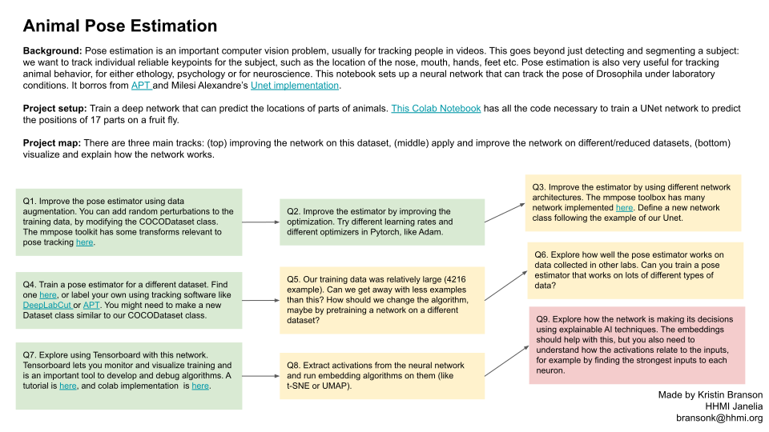
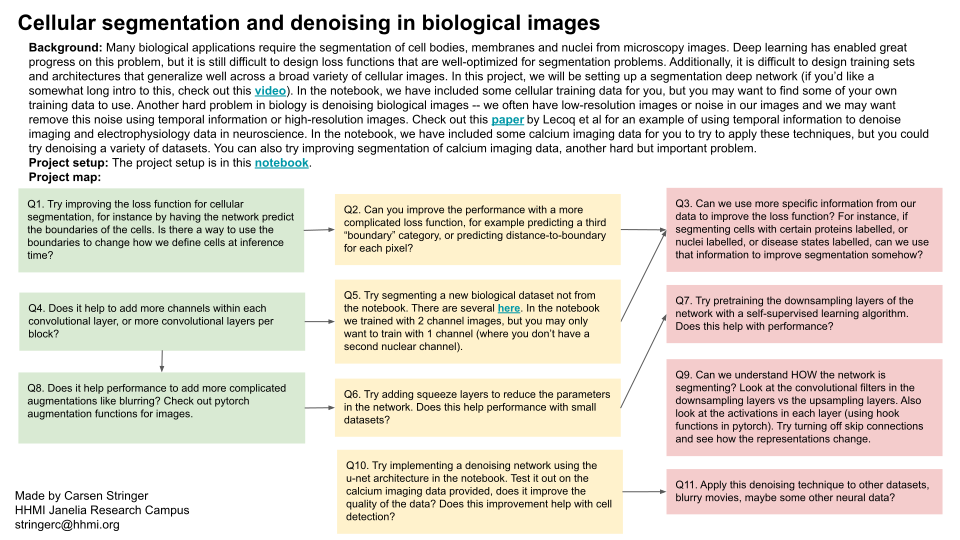
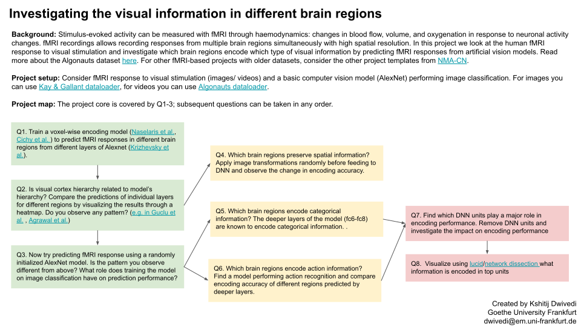
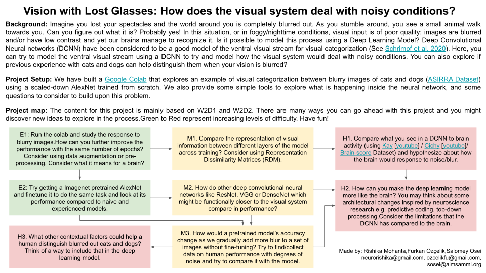
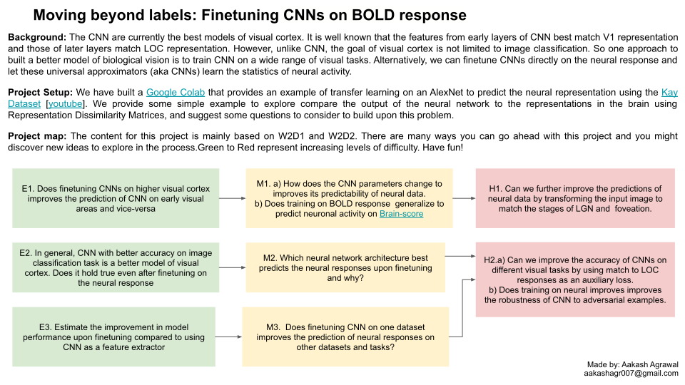
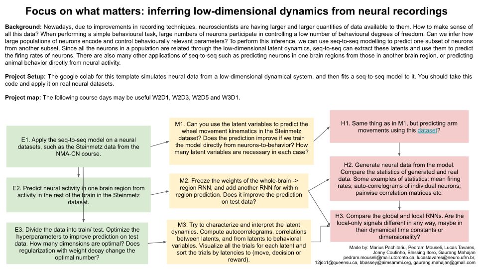

# Slides

Click on each image below to see a full browser version!

# Animal Pose Estimation

# Cellular segmentation and denoising in biological images

# Investigating the visual information in different brain regions

# Vision with lost glasses

# Moving beyond labels: finetuning CNNs on BOLD response

# Focus on what matters: inferring low-dimensional dynamics from neural recordings

