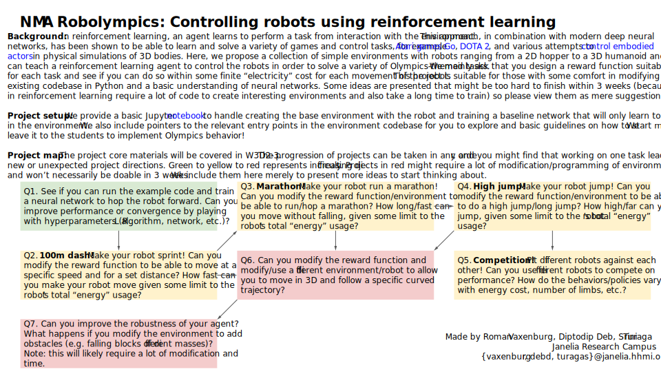
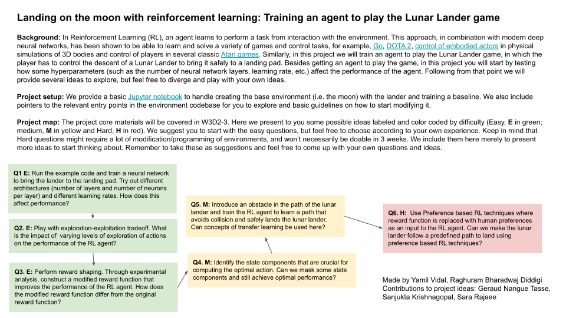
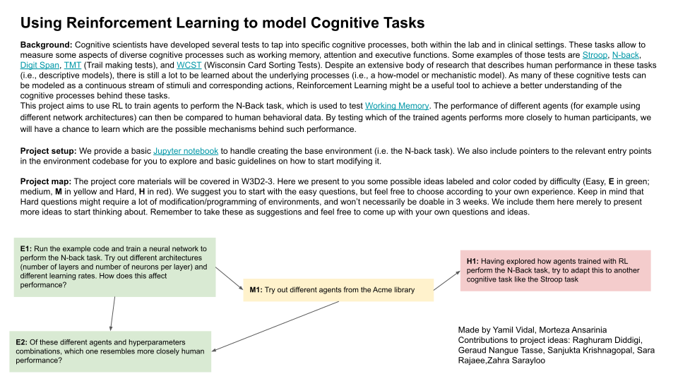

# Slides

Click on each image below to see a full browser version!

## NMA Robolympics: controlling robots using reinforcement learning

## Landing on the moon with reinforcement learning

## Using reinforcement learning to model cognitive tasks

